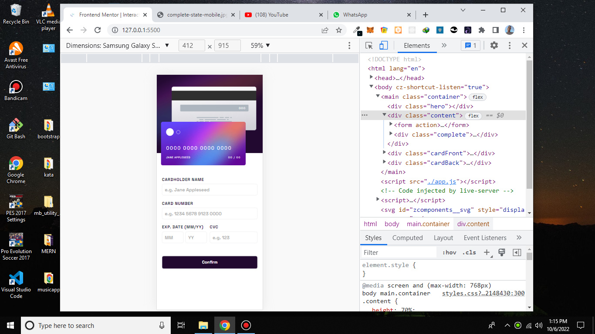
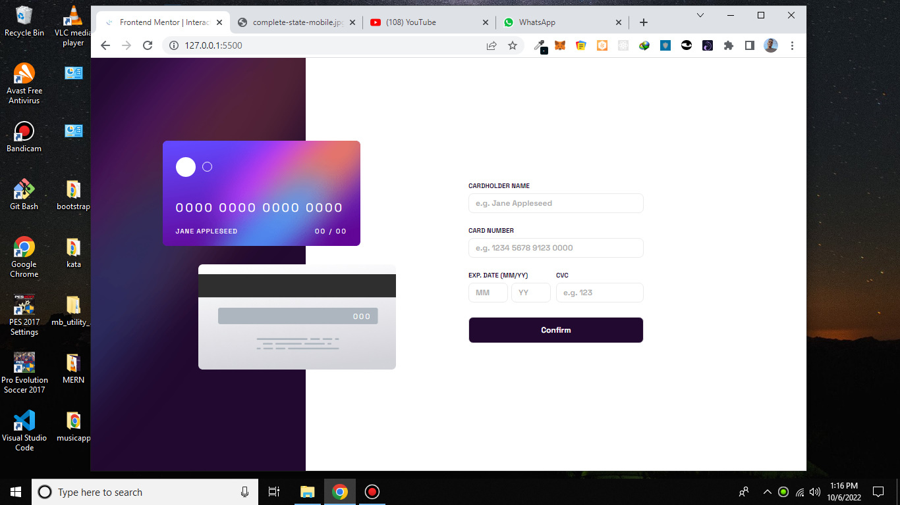

# Frontend Mentor - Interactive card details form solution

This is a solution to the [Interactive card details form challenge on Frontend Mentor](https://www.frontendmentor.io/challenges/interactive-card-details-form-XpS8cKZDWw). Frontend Mentor challenges help you improve your coding skills by building realistic projects.




## Table of contents

-   [Overview](#overview)
    -   [The challenge](#the-challenge)
-   [My process](#my-process)
    -   [Built with](#built-with)
-   [Author](#author)

## Overview

### The challenge

Users should be able to:

-   Fill in the form and see the card details update in real-time
-   Receive error messages when an input field loses focus or has an invalid character (format):

    Errors might include

    -   Any input field is empty
    -   The card number, expiry date, or CVC fields are in the wrong format

-   View the optimal layout depending on their device's screen size
-   See hover, active, and focus states for interactive elements on the page

## My process

### Built with

-   Semantic HTML5 markup
-   CSS custom properties
-   Sass
-   Flexbox
-   CSS Grid
-   Desktop-first workflow
-   Javascript
-   DOM manipulation

### What I learned

Use this section to recap over some of your major learnings while working through this project. Writing these out and providing code samples of areas you want to highlight is a great way to reinforce your own knowledge.

### How it works

Javascript is used to validate form . How?

-   On each input's focus , error of that error loses its display. Example :

```js
cvcInput.addEventListener("focus", () => {
	cvcErr.style.display = "none";
});
```

-   When input loses its focus , blur. Its value is checked to see if it is empty. If so, display an error to tell user to fill in that particular input

-   When input receives a keyup event, the value of the input is matched with a RegExp to display an error not.

## Form submit process

-   Check if all inputs are empty , if so don't do form validation

```js
if (name == "" && number == "" && cvc == "" && month == "" && year == "") {
	return;
}
```

-   When form is submitted , all error messages are fetched and with Js' every method , we check if all error messages have a display of none, if so display success message

```js
let check = arr.every((e) => {
	let style = getComputedStyle(e);
	return style.display == "none";
});
```

## Author

-   Frontend Mentor - [@yourusername](https://www.frontendmentor.io/profile/scyre27)
-   Twitter - [@yourusername](https://www.twitter.com/scyre27)
